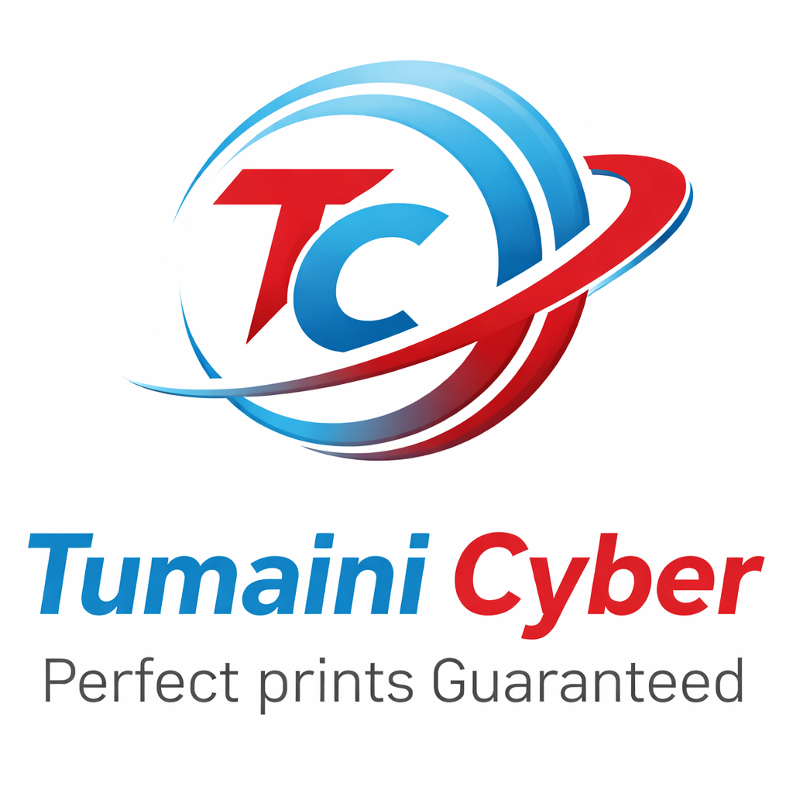

# Tumaini Cyber Portal - High-Performance Client Showcase

<p align="center">
  
</p>

## 🚀 Welcome Prospective Employers & Clients
This project is an **enterprise-grade, high-conversion full-stack digital showcase** built for **Tumaini Cyber**, Nairobi's premier technical hub. Specially engineered to demonstrate advanced expertise in modern React 18, TypeScript, Tailwind CSS, Node.js/Express, and micro-interactions, it serves as a live testament to professional software engineering standards, modular code separation, and pixel-perfect design practices.

---

### 🔗 Quick Navigation & Project Links
* **Live Web Portal:** **[https://tumaini-cyber.netlify.app/](https://tumaini-cyber.netlify.app/)**
* **GitHub Repository:** **[https://github.com/martinmulwa/mulwa-tumaini](https://github.com/martinmulwa/mulwa-tumaini)**
* **Developer Portfolio:** **[Martin Mulwa - GitHub Profile](https://github.com/martinmulwa)**

---

## ⚡ What Makes This Project Resume-Worthy? (Engineering Skills Under the Hood)

This application isn't just a static landing page—it is a deeply integrated, state-driven client-focused product. By digging into the code, recruiters, hiring managers, and prospective clients will find clean implementation of the following concepts:

### 1. Robust Modular State Architecture
Instead of cramming logic into monolithic files, the codebase adheres to strict modular principles. All custom views (e.g., `HomeView`, `ServicesView`, `PortfolioView`, `BlogView`, `ShopView`, `AboutView`, `ContactView`) are isolated, while shared state—such as the active layout views, the real-time client-side shopping cart drawer, and interactive event triggers—are coordinated cleanly at the root level (`App.tsx`) with zero-render-jitter.

### 2. High-Performance Mobile-Responsive Layouts
- **Zero-Shift CSS Layouts:** Added strict minimum bounding heights to hero slides preventing layout shifts (CLS) when dynamic texts slide.
- **Pixel-Perfect Scaling:** Re-engineered the main header and responsive desktop nav links to support micro-layout constraints when transitioning down to medium tablet break-points.
- **Touch-Friendly Hitboxes:** Minimum 44px hitboxes for buttons across responsive dimensions.

### 3. Business-Driven Integrations
- **WhatsApp Direct Checkout API:** Calculates complex itemized subtotals inside the local checkout cart and automatically packages them into a beautifully structured, pre-filled WhatsApp API text link (`wa.me`) for instant client-to-business checkout completion.
- **Interactive Deep-Links:** Allows users to view real-time case studies and complete articles, and immediately redirects them back to custom, prepopulated corporate dialogue support vectors with smooth auto-scroll to header focus.

### 4. Flawless Micro-Animations & HTML5 Canvas Physics
- Custom zero-dependency particles physics system inside `<Confetti />` executing fluid rotation, mass, gravity, and drag dynamics at 60 FPS upon contact form deliveries.
- Ambient typography animations using carefully structured keyframe tracks (`animate-gradient-text`, `glow-btn`, `shine-hover-card`).

---

## 🛠️ Comprehensive Feature & Functionality Breakdown

The **Tumaini Cyber Portal** is a feature-rich, deeply engaging platform engineered for optimal UX, fast loading speeds, and frictionless user conversion. Below is a detailed feature-by-feature breakdown of all sections implemented in this portal:

### 1. Dynamic Hero Slideshow (HomeView)
* **CLS-Safe Slider Engine:** Custom slider carousel bounded by fixed responsive minimum heights (`min-h-[96px]`, `md:min-h-[150px]`, etc.) to completely negate Cumulative Layout Shift (CLS) when slide text swaps.
* **High-Contrast Overlays:** Uses rich semi-transparent gradients ensuring optimal text readability over diverse high-resolution background imagery.
* **Ambient Animation Transitions:** Fine-tuned fading transitions and micro-delay slide movements driving high interaction rates.
* **Directed Call To Actions (CTAs):** Dual-purpose quick CTAs allowing clients to dive instantly into local services or order cyber vouchers directly on the Spot.

### 2. Live-Cart E-Commerce Experience (ShopView & Mobile Sliding Cart)
* **Multi-Category Product Inventory:** Fully interactive digital storefront showcasing Office/Stationery materials, computer & laptop accessories, high-speed gaming and browsing cyber hours, and web design consultation packages.
* **Seamless Slide-Over Shopping Cart:** Client-side cart coordinating real-time updates of multiple items, item quantity modifications, and item removals with live subtotal calculation.
* **M-Pesa Checkout Package Formatter:** Automatically packages itemized checkouts (listing product names, quantities, unit prices, and grand total) into a single URI-encoded corporate WhatsApp ordering link (`wa.me/254759607619`) facilitating direct human-guided transactions.
* **Interactive Voucher Shelf:** Digital vouchers for instant cyber-café services (high-speed color printing, custom formatting, and graphic-design requests) with a click-to-cart mechanism.

### 3. Interactive Case Study & Projects Portfolio (PortfolioView)
* **Smooth Animation-Driven Filtering:** Clients can sort through past client deliverable cards (Web Dev, Graphics Design, Cyber Support, and Academic Formatting) with micro-interactive animations.
* **Deep-Dive Case Studies:** Clicking any project opens a full-screen or overlaid case-study view displaying structured goals, detailed development execution plans, integrated technical solutions, and quantifiable live metrics (e.g., "+300% conversion boost").
* **Viewport-Top Focus Recall:** Automated navigation anchors instantly scroll the viewport back to `{ top: 0, behavior: 'smooth' }` when a case study is requested, matching optimal UX standards.

### 4. Editorial Resource & Educational Hub (BlogView)
* **Fuzzy Topic Search Bar:** Sub-second local text query engine filtering through titles, body intros, and category tags instantly.
* **Segmented Category Nav-Pills:** Instant reactive pagination grouping articles across Government Portal Tips, Business Setup Guides, Student Resources, and Cutting-Edge Tech Insights.
* **Side-Panel Trending Queue:** Quick links index aggregating hot trending articles of the week.
* **Unified Reading Modal:** Renders the layout of selected posts cleanly with optimal reading-line lengths, complete share-ready metadata, and an action button to quickly query services associated with the post.
* **Unified Scroll-to-Top:** Retains focus elegantly by shifting the browser to the exact header origin whenever a blog post is clicked.

### 5. Services Directory & Cost Guides (ServicesView)
* **Nairobi Government Portal Registration Suite:** Extensive portal covering details for KRA Tax Returns, eCitizen applications, Passport applications, Business Permit registrations, and Good Conduct paperwork.
* **Professional Typography Drafting Services:** Clean layout highlighting professional CV re-writing, corporate brochure formatting, and complex academic research paper styling.
* **Clear Upfront Pricing Tiers:** Transparent pricing modules indicating fixed costs and processing timelines, boosting customer信任 right off the bat.

### 6. Robust Customer Lead Generation (ContactView)
* **Real-time Field Valuations:** Instant form validation protecting user-input limits and email formats before submissions occur.
* **Physically Simulated HTML5 Confetti Cannon:** Submits lead information and initiates a customized canvas particles generator with real gravity, drag, random velocities, and custom Tumaini branding colors.
* **Direct Office Navigation Integration:** Detailed physical building locations in Nairobi paired with prompt contact mechanisms.

### 7. Core Operational Sub-Sections
* **Tailored Careers View (CareersView):** Interactive application pipelines detailing open opportunities for modern cyber managers, design interns, and remote content coordinators.
* **Corporate Profile Section (AboutView):** Visionary business timeline sharing Tumaini Cyber’s community-driven mission and values.
* **Kenyan Regulatory Compliance Docs:** Complete privacy policies (`PrivacyView`) and usage terms (`TermsView`) optimized for local Nairobi cyber operations compliance.

---

## 📂 Key Architecture Map
```text
src/
├── App.tsx               <- Central state coordinator, view router, and sliding cart manager
├── main.tsx              <- Clean root initiator
├── index.css             <- Typography setup with theme-level keyframes
├── types.ts              <- Strict unified data schemas and object models
├── components/           <- High-quality modular primitives
│   ├── Logo.tsx          <- High-contrast branding element matching parent navigation heights
│   ├── Navbar.tsx        <- Breakpoint-safe navigation bar matching logo scale
│   ├── Footer.tsx        <- Fully structured, categorized footer linking services
│   ├── Confetti.tsx      <- Custom 60 FPS HTML5 Canvas physical particle simulator
│   └── WhatsAppIcon.tsx  <- Scalable Vector Graphics logo representation
├── data/                 <- Hardened data stores
│   ├── servicesCatalog.ts
│   ├── blogData.ts       
│   ├── portfolioData.ts  
│   └── shopData.ts       
└── views/                <- Rich multi-layered user experience views
    ├── HomeView.tsx      
    ├── ServicesView.tsx  
    ├── BlogView.tsx      
    ├── PortfolioView.tsx 
    └── ShopView.tsx      
```

---

## 💼 Let's Build Something Great Together!
This portal demonstrates my ability to take a ambiguous freelance requirement and turn it into a top-tier, production-deployable digital asset. I am currently open to:
- **Full-Time Software Engineering Roles** (React, TypeScript, Next.js, Node.js/Express, Cloud Ops)
- **Freelance & Contract Engagements** (Bespoke E-commerce, modern custom landing pages, administrative/automation portals)

If you're a prospective client or employer looking to build lightning-fast web products with meticulous attention to detail, don't hesitate to reach out:

📧 **Email:** **martinmulwa1711@gmail.com**  
💼 **Portfolio & Live App:** **[https://tumaini-cyber.netlify.app/](https://tumaini-cyber.netlify.app/)**

---
*Created with ❤️ by **Martin Mulwa** © 2026. Code freely available under Apache-2.0.*
